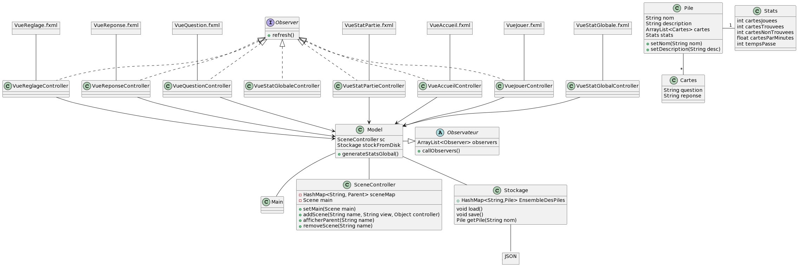

# Coding Week G9

# Présentation du sujet 
" Vous devez développer une application qui permet de favoriser l’apprentissage en
utilisant des flashcards (ou cartes questions-réponses numériques). Cette application propose
deux modes d’utilisation : le mode “création” et le mode “apprentissage”. Le mode création permet
de créer des piles de cartes dont une face contient une question et l’autre face la réponse à cette
question. Le mode apprentissage permet de réviser le contenu des cartes."

# Lancement à partir du .jar

Pour lancer l'application, il vous faudra installer javafx.
Il suffira ensuite de vérifier que la variable d'environnement JAVAFX_HOME soit bien initialisée, et d'exécuter la commande suivante :
    
    java --module-path ${JAVAFX_HOME}/lib --add-modules=javafx.controls,javafx.fxml -jar codingweek-09.jar

# Lancement via le projet Gradle

Ce projet est auto-suffisant dans le sans où il propose d'utiliser l'outil Gradle (https://gradle.org/) pour construire l'application fournie.
Un simple `./gradlew run` dans un terminal devrait vous télécharger l'outil gradle, télécharger les dépendances nécessaires (JavaFX entre autre), lancer la compilation et exécuter le programme. 

Il se peut que vous rencontriez des problèmes. Voici quelques solutions :
- il faut que le script `./gradlew` soit exécutable (un simple `chmod a+x ./gradlew` devrait faire l'affaire)
- Gradle ne supportant pas encore Java 19, il faut utiliser une version 17 ou 18 du Java Development Kit (JDK) (utiliser la commande `java --version` ou un `./gradlew --version` pour vérifier votre version actuelle du JDK.)

Cette configuration peut également être importée dans IntelliJ pour créer un projet fonctionnelle à partir de celle-ci. Pour cela, lors de la création de votre projet IntelliJ, il faut sélectionner le fichier `build.gradle` et non pas uniquement le répertoire du projet.

//!\\ Si l'environnement Gradle n'est pas mis en place après le git clone, veuillez ouvrir le projet sur IntelliJ pour générer les fichiers manquants.

# Planning

## Jour 1

Faire une conception partielle de l'application attendu pour le dernier jour.
Préparer le dépot git et mettre en place un environnement Gradle.
Créer une application basique qui affiche sur une seule vue l'ensemble des Pile stocker en JSON.

## Jour 2

Créer la fonctionnalité Apprentissage: sélectionner une Pile dans le menu puis afficher les cartes les unes à la suite des autres en laissant un temps de reflexion.
Mettre en place un module de stockage en JSON.
Créer le Menu et gérer les fonctionnalités du menu.

## Jour 3

Créer la fonctionnalité Création: ouvrir une vue permettant de modifier l'ensemble des caractéristiques de la pile.
Poursuivre la mise en place de la fonctionnalité Apprentissage.

## Jour 4

Améliorer l'experience utilisateur.
Finir les fonctionnalités Apprentissage et Création si besoin.

# Carnet de bord

## Diagramme de classe

Ce diagramme de classe de conception correspond à l'application que l'on espère obtenir. Il a été conçu pendant le premier jour de la coding week (et n'a pas été mis à jour).

## Jour 1

Aujourd'hui, nous avons fait une conception globale de l'application pour savoir vers quoi on se dirigera, c'est notre RoadMap. Nous avons dessiné les croquis de toutes les vues que l'on aimerais avoir, ainsi qu'un diagramme de classe. Nous nous sommes partagés le travail à faire pour la journée. Chacun des membre a commencé à travailler sur une fonctionnalité qui, ensemble, formeront une première version de l'application livrée en fin de journée.

### Resultat jour 1

Le résultat est une projet Gradle fonctionnel. Il affiche le menu principal et n'est pour l'instant pas intéractif.

## Jour 2

Aujourd'hui, nous avons commencé par nous partager le travail à faire dans la journée. Pour développer notre application de manière itérative, nous nous sommes organisés pour être capables de rendre une application exécutable à la fin de la journée. Nous commençons par nous partager le travail: nous allons travailler sur 3 vues aujourd'hui: la vue du "menu" et les vues du mode "apprentissage", et nous devons aussi avoir terminé le stockage et la récupération de données en utilisant le format .json.

Beaucoup de problèmes liés au GitLab nous ralentissent durant notre travail, ce qui nous fait perdre du temps. On a fait attention à bien mettre en place le .gitignore gagner en efficacité.

### Resultat jour 2

Nous avons une application fonctionnelle qui réalise toutes les actions dites précédemment. Cependant, la lecture des cartes ne permet pas encore de s'entrainer car on ne cache pas encore la réponse. Ce sera l'objectif de demain.

## Jour 3

Aujourd'hui, nous avons développé nos fonctionnalités Apprentissage et Création. Nous nous sommes partagés le travail de manière à préparer chaque vue de notre modèle chacun de son côté pour ne pas géner les autres. Notre objectif est de livrer aujourd'hui une application "quasi-finale", à l'expérience utilisateur près (pas de design, ni de tests trop poussés...).

Nous avons encore des problèmes liés au GitLab, mais de moins en moins. Nous avions failli nous mettre à travailler sur des branches différentes mais cette solution semble trop complexe pour mettre en place les "merge" finaux puisque l'on dispose de peu de temps. On s'organise donc plutôt pour commit au "bon" moment, et ne plus effacer le travail des autres par mégarde comme ça a pu être le cas précédemment...

### Resultat jour 3
Nous sommes parvenus à mettre en place notre application, il nous reste encore quelques corrections à effectuer, mais le fonctionnement global est prêt. 

## Jour 4

Aujourd'hui, nous devons finir les détails de notre application: il reste des fonctionnalitées à améliorer, quelques bugs à corriger... Nous nous réservons l'après-midi pour la tester le plus complétement possible, et mettre en place nos messages d'erreurs et d'alertes.

### Resultat jour 4
Après un sprint final, nous sommes parvenus à livrer l'application fonctionnelle, testée par nos soins, dans les temps.

